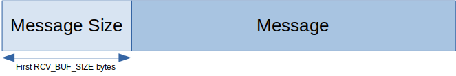

# tcp-cJSON
[](https://www.repostatus.org/#inactive)
[](https://img.shields.io/github/last-commit/jordan396/tcp-cJSON/master.svg)
[](https://img.shields.io/github/repo-size/jordan396/tcp-cJSON.svg)
[](https://img.shields.io/github/followers/jordan396.svg?label=Follow)

Starter template for transferring JSON data over TCP.

## Getting Started
*Transmission Control Protocol* (TCP) is one of the main protocols in the transport layer of the internet protocol (IP). Unlike UDP, TCP does not preserve message boundaries. One solution is to use a **common message format** such as:



## Installation
Download *cJSON.x* and *tcp_cJSON.x* directly, or clone this repository. Then, import *tcp_cJSON.h* into your project.
```c
#include <./tcp_cJSON.h>
```

## Usage
A simple example on how to use tcp_cJSON can be found [here](./examples). 

For a more complicated example, refer to this [project](https://github.com/Jordan396/trivial-twitter-v2).

Refer to this [link](https://github.com/DaveGamble/cJSON) for instructions on how to use cJSON.

## License
MIT License

>  Original work Copyright (c) 2009-2017 Dave Gamble and cJSON contributors
>  
>  Modified work Copyright (c) 2019 Jordan396
>
>  Permission is hereby granted, free of charge, to any person obtaining a copy
>  of this software and associated documentation files (the "Software"), to deal
>  in the Software without restriction, including without limitation the rights
>  to use, copy, modify, merge, publish, distribute, sublicense, and/or sell
>  copies of the Software, and to permit persons to whom the Software is
>  furnished to do so, subject to the following conditions:
>
>  The above copyright notice and this permission notice shall be included in
>  all copies or substantial portions of the Software.
>
>  THE SOFTWARE IS PROVIDED "AS IS", WITHOUT WARRANTY OF ANY KIND, EXPRESS OR
>  IMPLIED, INCLUDING BUT NOT LIMITED TO THE WARRANTIES OF MERCHANTABILITY,
>  FITNESS FOR A PARTICULAR PURPOSE AND NONINFRINGEMENT. IN NO EVENT SHALL THE
>  AUTHORS OR COPYRIGHT HOLDERS BE LIABLE FOR ANY CLAIM, DAMAGES OR OTHER
>  LIABILITY, WHETHER IN AN ACTION OF CONTRACT, TORT OR OTHERWISE, ARISING FROM,
>  OUT OF OR IN CONNECTION WITH THE SOFTWARE OR THE USE OR OTHER DEALINGS IN
>  THE SOFTWARE.