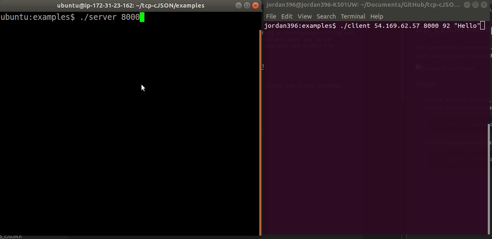

# tcp_cJSON examples

In this example, the client creates a JSON payload containing a *userMessage* string and a *userNumber* integer. It then sends this payload to the server. 

When the server receives this payload, it prints the raw request. It also extracts and prints the individual JSON fields.



## Usage
1. In the ./examples directory, run `make` to compile the client and server programs.
2. To run the program on the server side:
   ```bash
   $./server <Server Port>
3. To run the program on the client side:
   ```bash
   $./client <ServerIP> <ServerPort> <Number> "Message"
   ```